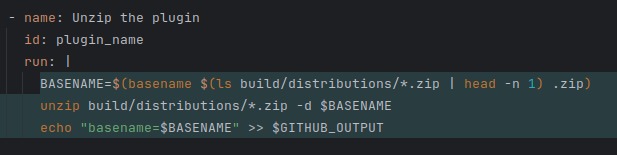
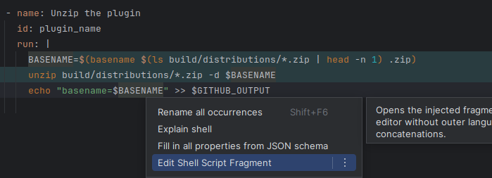
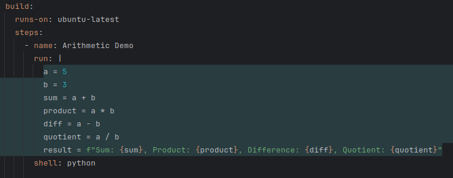
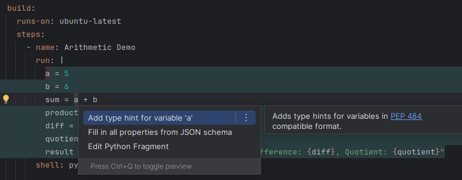

# GHA Workflow Plugins

Welcome! This organization develops JetBrains plugins to make working with GitHub Actions easier.

## 🚀 Featured Plugin: Run Syntax Support

Smart syntax highlighting for `run:` steps in GitHub Actions YAML files.

[Download from JetBrains Marketplace](https://plugins.jetbrains.com/plugin/27841-github-actions-run-highlighter)  
[Source code on GitHub](https://github.com/gha-workflow-plugins/run-syntax-support)

### Screenshots

**Bash**

**Python**

