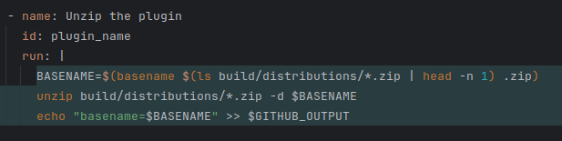
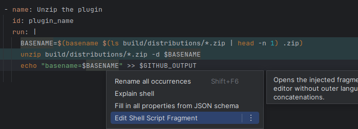
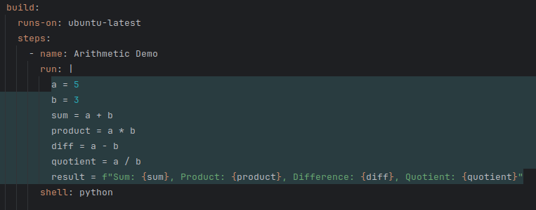
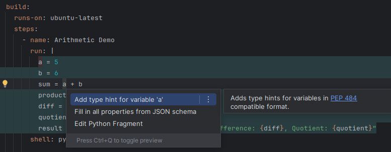

# GHA Workflow Plugins

Welcome! This organization develops JetBrains plugins to make working with GitHub Actions easier.

## 🚀 Featured Plugin: Run Syntax Support

Smart syntax highlighting and language injection for GitHub Actions YAML — in both
workflow files (`.github/workflows/*.yml`) and composite action files (`action.yml`).

[Source code on GitHub](https://github.com/gha-workflow-plugins/run-syntax-support)

### Features

- **`run:` steps** — highlighted in the right language based on `shell:`: Shell Script (`bash`, `sh`), PowerShell (`pwsh`), Python (`python`) and Batch (`cmd`).
- **`actions/github-script`** — inline JavaScript in the `script:` input.
- **GitHub expressions** — `${{ }}` highlighted inside injected blocks.

### Screenshots

**Bash**

**Python**

